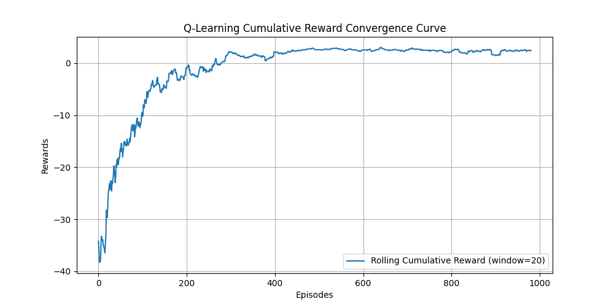

# Reinforcement Learning Lab


Tabular **model-free reinforcement learning** agents — **Q-Learning** and **SARSA** — implemented
from scratch in NumPy on a custom GridWorld, to study how on-policy vs off-policy updates and
ε-greedy exploration affect convergence.



## Environment
- **Grid:** 5×5, state = `(x, y)`.
- **Start** `(0,0)` · **Goal** `(4,4)` `+10` · **Pit** `(2,2)` `−10`.
- **Actions:** up / down / left / right.
- **Exploration:** ε-greedy, decaying exponentially 1.0 → 0.05.

## Run
```bash
pip install -r requirements.txt
python q_learning.py     # trains over episodes, prints learned Q-grid, saves reward_curve.png
```

## Files
```
gridworld.py    # custom discrete Gym-style environment
q_learning.py   # Q-learning + SARSA tabular updates
```

## Why
Reinforcement learning is easiest to *trust* once you've built the update rule yourself. This lab
implements the Bellman backups directly and visualizes how the policy and value estimates evolve —
no library doing the learning for you.
